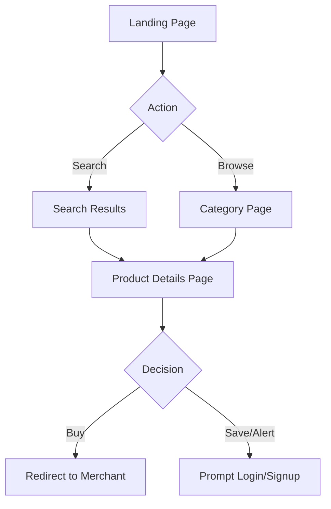
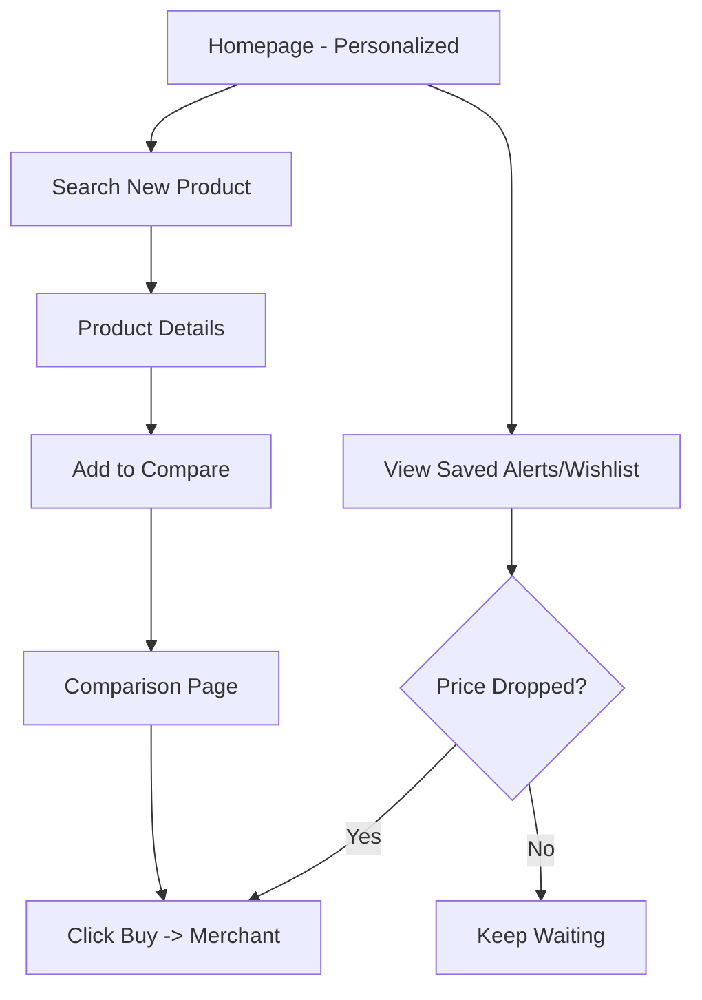
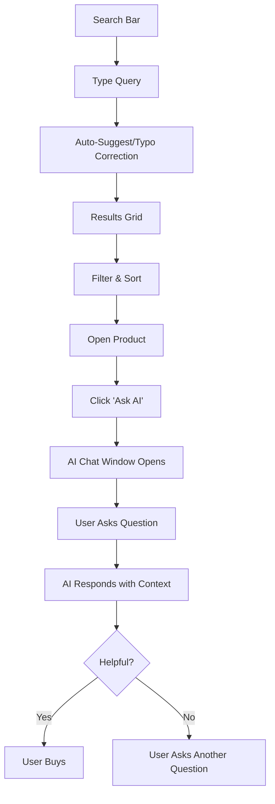
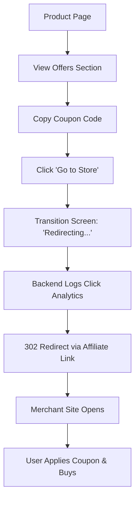
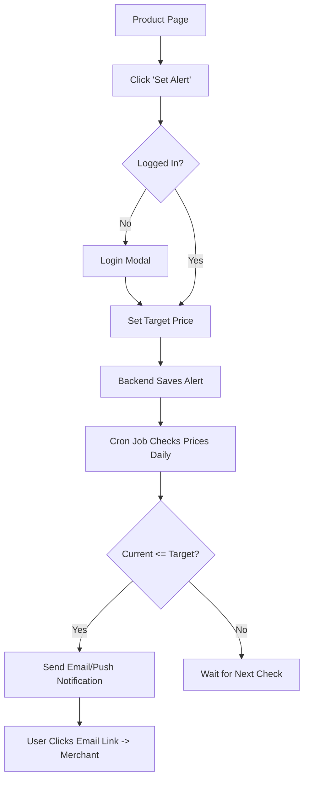
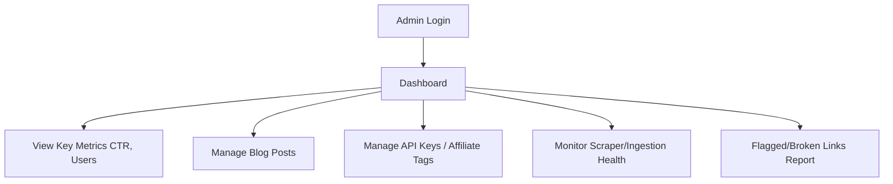
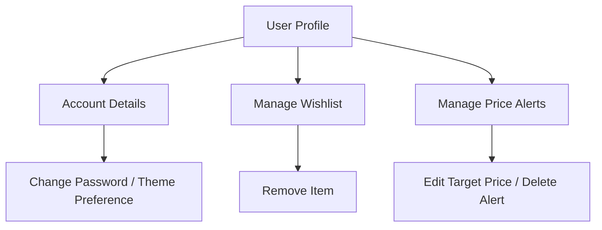

# User Flows

This document maps out the specific flows users take through the ShopSense AI platform. 

*(Note: Mermaid syntax is used below for flow generation. These can be visualized in any Mermaid-compatible Markdown viewer).*

## 1. Guest User Flow

## 2. Registered User / Returning User Flow

## 3. Search & AI Chat Flow

## 4. Affiliate Click & Coupon Flow

## 5. Price Alert Flow

## 6. Admin Flow

## 7. Account Settings & Wishlist Flow

